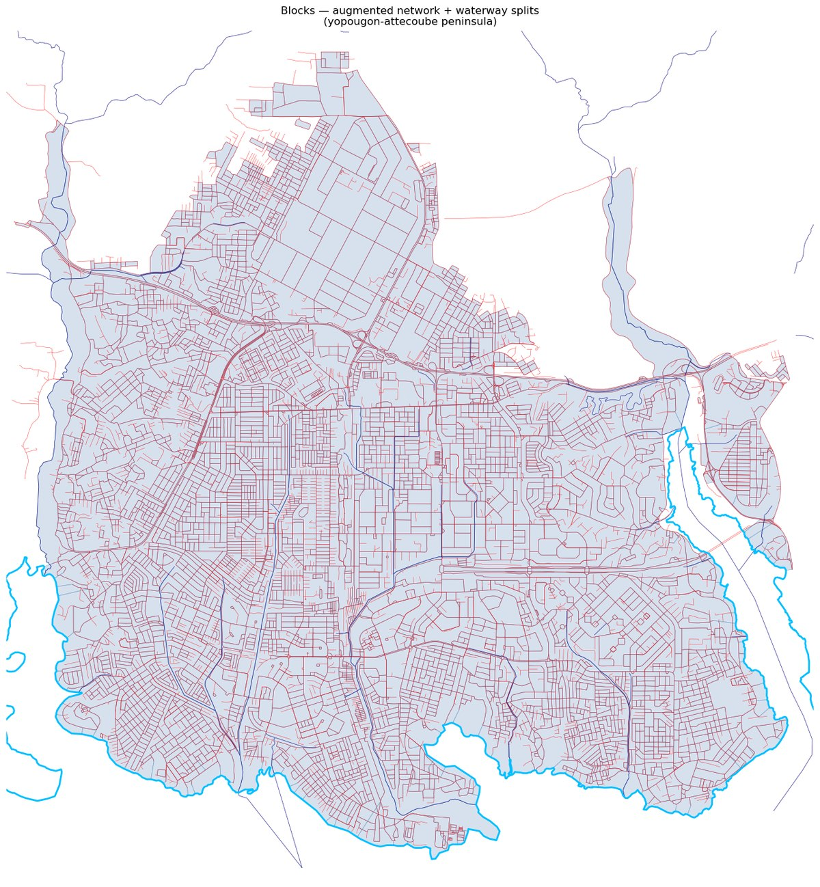
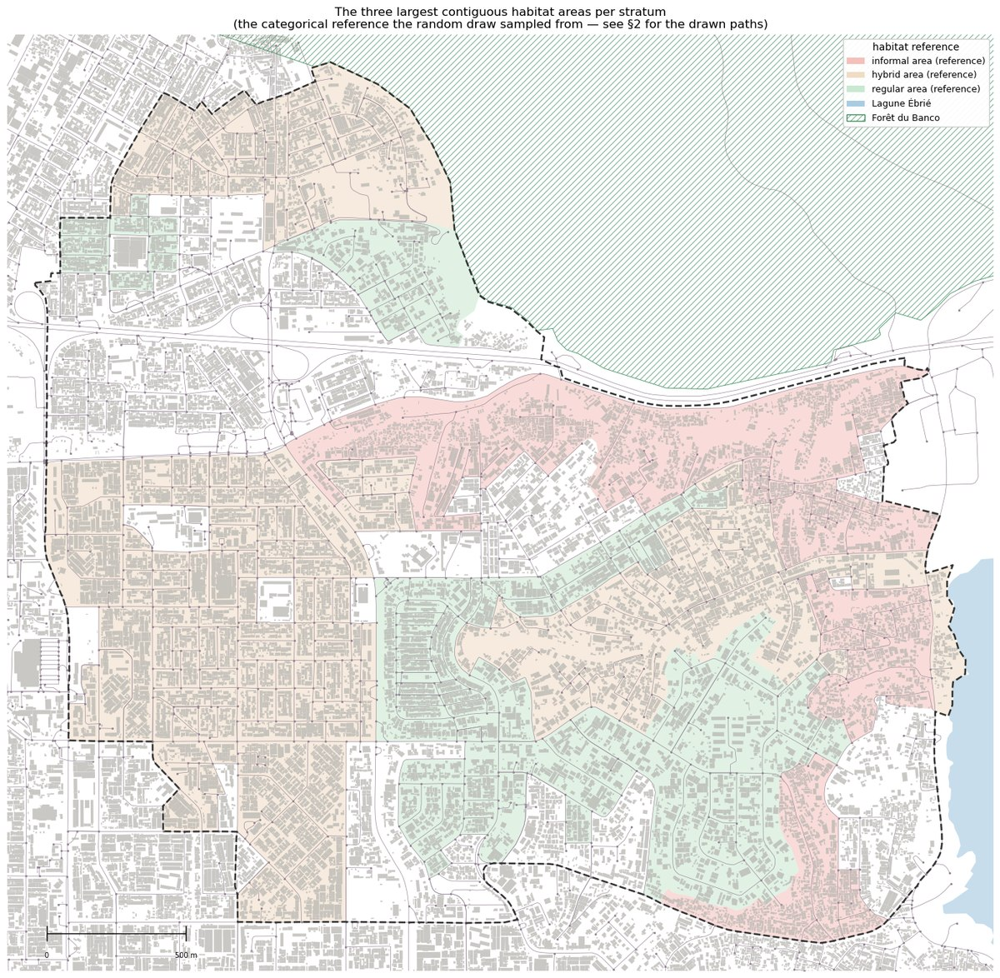
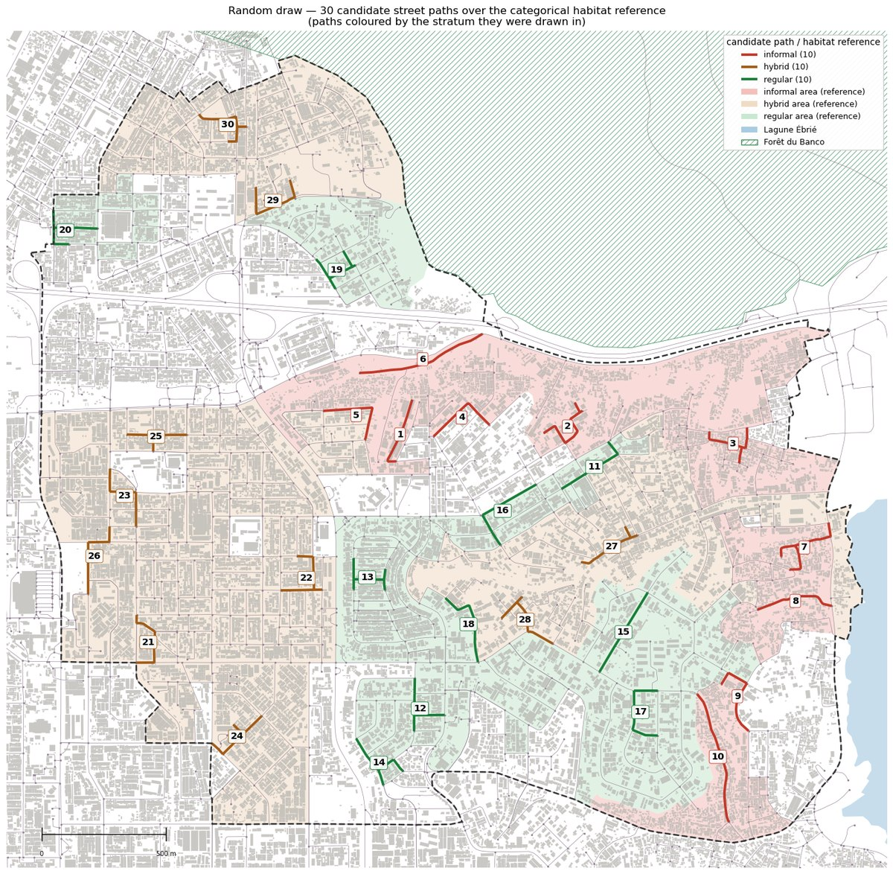
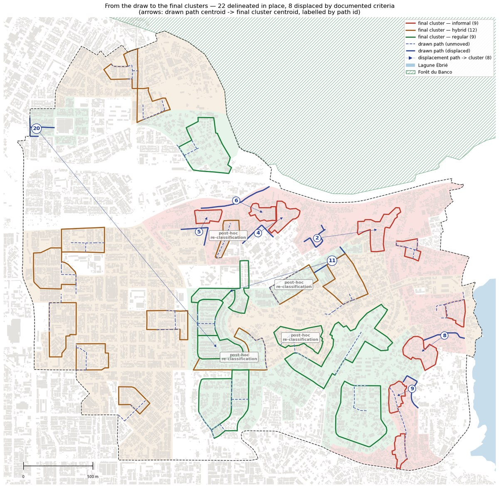
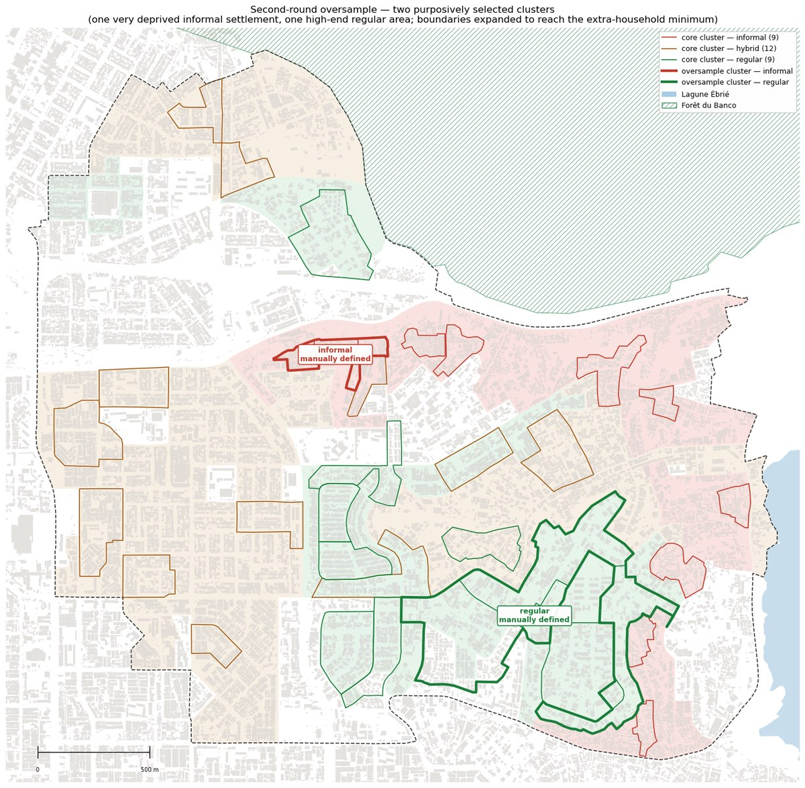
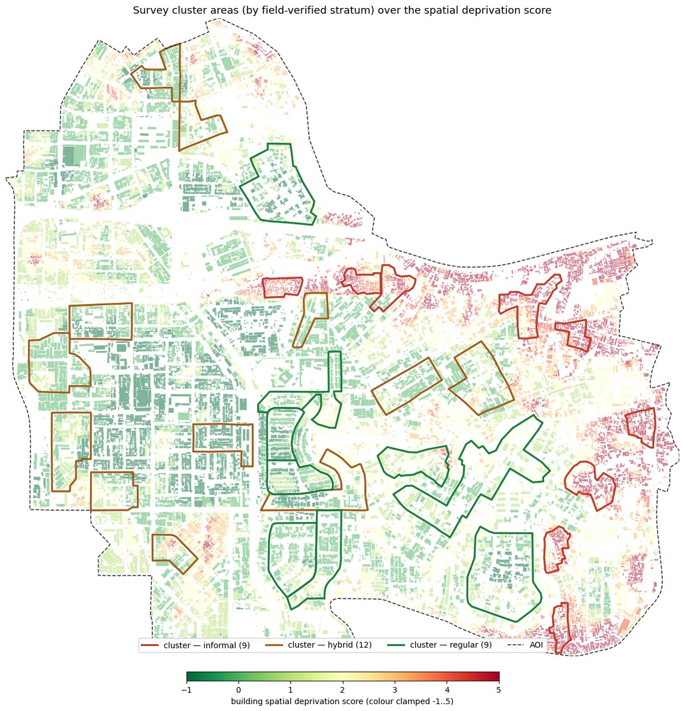

# Quasi-randomized survey sampling stratified by urban form — Yopougon, Abidjan

Documents the **sampling strategy** of the YopouLab household survey — a quasi-randomized, two-stage cluster
design **stratified by urban form** — and its **validation**: a morphometric audit of how well the selected
survey clusters represent the variety of urban habitat in the study area (AOI).

The workflow has two phases:

- **SAMPLING (notebooks `1`–`2`)** — define urban blocks as areal units; categorise them into three urban
  "habitats" (strata) by expert consultation; draw survey clusters at random within those strata, with
  documented manual adjustments.
- **VALIDATION (notebooks `3a`–`3b`)** — compute building-level morphometrics, distil them into a graded
  **spatial deprivation score** (following the *spatial signals of poverty* literature — Taubenböck, Wurm and
  colleagues), and use it to check that the clusters span the range of built environments of the AOI (the
  HDSS frame) and of Yopougon as a whole (the frame of an eventual expansion).

**The fieldwork itself sits between the two phases** — the validation instrument (the score) post-dates the
sampling. This keeps the provenance honest: the clusters were drawn against the expert habitat framework, not
against the score, and notebooks `3a`–`3b` then verify, after the fact, that the sampled areas span the range
of built environments.

## Workflow

| Step | Notebook / manual | Does | Key outputs |
|---|---|---|---|
| **1** | **`1_Urban-blocks`** | **Builds the street network (OSM) and defines city blocks** — the areal units of the sampling — by polygonising the network, closing the lagoon shore and splitting on waterways | `data/temp/_check-blocks_geom.gpkg` |
| *1.1* | *manual corrections* | **Blocks are corrected by hand in QGIS** — see below | `data/temp/_check-blocks_geom_manual-corr.gpkg` |
| *1.2* | *manual corrections* | **Expert categorisation of the blocks into 3 habitat strata** (geographer, sociologist, epidemiologist, architect): spatial definition of the inhabited areas per stratum (blocks dissolved by stratum), largest zones retained | `data/raw/sampling_habitat-areas_reference.gpkg` |
| **2** | **`2_Cluster-draw`** | **Randomized draw of street edges** within the habitat areas, followed by field verification to confirm locations composing the final clusters selection | `data/raw/sampling_first-draw_clusters.gpkg` |
| 2.1 | *manual drawing* | **Cluster *areas* are delineated** by hand based on the output of step 2 | `data/raw/_GRAPPES_final-REF.gpkg` |
| **3** | **`3a_Morphometrics`** | **Computes urban morphometrics** at building-, tessellation- and street- levels | `data/temp/*_momepy_bdg.gpkg`, `*_momepy_tess.gpkg`, `streets.gpkg`, `nodes.gpkg`, `edges.gpkg` |
| *3.1* | **`3b_Spatial-deprivation-score-representativity`** | **Part A:** scores every building with a graded **spatial deprivation score (−1..8)**. **Part B: audits the diversity and representativity of sampled areas** (in terms of morphometrics) against the AOI (HDSS frame) and against Yopougon as a whole (expansion frame) | `data/output/*buildings_spatial-deprivation-scored.gpkg`, `*blocks_spatial-deprivation-scored.gpkg` |

Run the notebooks in the order `1` → `2` → `3a` → `3b`. Notebooks `1` and `3a` both build the street network
from the same OSM queries and share the OSMnx HTTP cache (`cache/`), so the sampling phase runs without the
validation phase and vice versa.

## The sampling design, in brief

Stratified two-stage cluster sampling. **Strata** = three urban habitats (regular / hybrid / informal) defined
from the built environment by expert consultation and later consolidated into a measured spatial deprivation score.
**First stage** = survey clusters selected by a **random draw of street paths** within each stratum
(constraints: ≥ 300 m, ≥ 100 buildings within 50 m, 100 m spacing, waterway quotas), followed by
**site verification with documented, criteria-based adjustments**: most clusters are delineated in place
around their drawn path, and a minority are displaced following explicit, documented criteria — every
adjustment is traceable via `path_id` (see notebook `2` §3). **Second stage** = systematic selection of
households within clusters. The realised selection is therefore **quasi-random**: inclusion probabilities are
not recoverable (estimates are reported unweighted), and representativity is audited descriptively in
notebook `3b`. A second survey round added a purposive oversample, including two dedicated contrast clusters
(notebook `2` §4).

## The sampling decision algorithm, step by step

Six steps, each producing the input the next one needs. The map cited at each step is the visual record of
that step's output.

1. **Define urban blocks.** Polygonise the OSM street network into blocks, then correct the result by hand in
   QGIS (missing roads merge blocks; data artefacts split them). *Notebook `1_Urban-blocks`.*

   

2. **Define the three largest contiguous areas per stratum.** Categorise the blocks into three habitat strata
   by expert consultation, dissolve by stratum, and retain only the largest contiguous zones per stratum — the
   only areas the next step samples from. *Notebook `2_Cluster-draw` §1, "Map — the habitat reference on its
   own".*

   

3. **Randomly draw road segments, 10 per stratum.** Draw street segments uniformly at random inside those
   zones, then grow each into a path meeting the length, density and spacing rules. *Notebook `2_Cluster-draw`
   §2, "Map of the draw".*

   

4. **Confirm segments and define cluster areas.** Site-verify every drawn path; delineate it into a final
   cluster area in place, or displace it following one of the documented criteria if the site does not support
   it. *Notebook `2_Cluster-draw` §3, "Map — where the manual stage moved the draw".*

   

5. **Define oversampled areas.** Purposively add contrast clusters (one very deprived, one high-end) on top of
   the core quasi-random selection. *Notebook `2_Cluster-draw` §4, "Second-round oversample".*

   

6. **Test the representativity of the selected survey areas against the built environment.** Score every
   building with the spatial deprivation score and compare its distribution inside the clusters against the
   AOI and against Yopougon as a whole. *Notebook `3b_Spatial-deprivation-score-representativity`, Part B.*

   

## Manual steps

Three stages of this workflow depend on human judgement and cannot be run from code. Each is documented where
it happens, so the automated parts either side remain reproducible.

### Block correction (step 1.1 — between notebooks `1` and `2`)

Polygonising a street network yields blocks that occasionally merge across missing roads or split on data
artefacts. The blocks from `1_Urban-blocks` are therefore reviewed in QGIS and corrected by hand; the
corrected layer (`data/temp/_check-blocks_geom_manual-corr.gpkg`) is the block definition used downstream
(notebook `3b`).

This layer is **not reproducible from code** and must be preserved. Its coverage is deliberately partial: it
contains only the blocks that were reviewed; areas of the AOI with no blocks are uninhabited and excluded from
the analysis.

### Habitat categorisation (step 1.2 — between notebooks `1` and `2`)

The urban blocks were **categorised into the three habitat strata by expert consultation** — geographer,
sociologist, epidemiologist and architect — informed by punctual field visits and consultations with local
partners. This defined the inhabited areas corresponding to each stratum (blocks dissolved by stratum,
largest contiguous zones retained), archived as `data/raw/sampling_habitat-areas_reference.gpkg`.

This layer is **not reproducible from code** and must be preserved. It is a deliberately coarse expert framework — not a
measurement — whose purpose was to steer the cluster draw; its measured successor is the spatial deprivation score of
notebook `3b`, which quantifies their agreement.

### Cluster delineation (step 2.1 — between notebooks `2` and `3a`/`3b`)

The random draw in `2_Cluster-draw` yields candidate street paths. Each was **site-verified and delineated by
hand into a cluster area**: most clusters are delineated *in place*, around their drawn path, while a minority
are **displaced following explicit criteria** (fringe position, lock-in between ineligible areas, field
re-categorisation of the surrounding area, spatial balance). Every cluster is traceable: the final layer
(`_GRAPPES_final-REF.gpkg` - **not reproducible from code** and must be preserved) carries a 1:1 `path_id` link to the originating path and the
field-verified stratum in `strate`. A few further clusters were re-categorised in place. Notebook `2` §3
documents and maps all of this.

## Data

```
data/
  raw/      inputs as received  — building footprints, NDVI / vegetation-mask /
            night-lights rasters (Google Earth Engine), the GEE scripts that produced them,
            and the two archival layers `sampling_first-draw_clusters.gpkg` and
            `sampling_habitat-areas_reference.gpkg` (see *Archival layers* below)
  temp/     intermediate layers produced by notebooks 1 and 3a (regenerable, except the
            manually corrected blocks — see above)
  output/   analysis products: scored buildings and block mean scores
```

Data files are large and are **not** tracked in version control (see `.gitignore`). Notebooks `1` and `3a`
regenerate everything in `data/temp/` except the manually corrected blocks.

## Archival layers — the first random draw

Two layers in `data/raw/` are archives of the sampling stage, loaded by `2_Cluster-draw` rather than
recomputed:

| Layer | What it is |
|---|---|
| `sampling_first-draw_clusters.gpkg` | the 30 candidate street paths drawn at random, from which the cluster areas were then delineated by hand |
| `sampling_habitat-areas_reference.gpkg` | the categorical habitat framework the draw ran against — the expert categorisation of step 1.2 (see *Manual steps*) |

This is deliberate. The draw cannot be reproduced: its random seed was not fixed when it ran, and the street
network and habitat reference it consumed have since been rebuilt. A re-run would produce *a* draw, but not the
one the cluster areas came from. Loading the archives keeps the documented provenance faithful.

The layer's geometry is the **pristine algorithm output**, and its `habitat` attribute is the stratum each path
was drawn in (10 per habitat, matching the allocation). An earlier vintage of this archive carried a partially
hand-edited `habitat` column, which the notebook used to distrust; the drawn strata have since been restored
(the archive preserves them in `habitat_original`), and field re-categorisations live where they belong — in
the `strate` attribute of the final cluster layer.

**Two generations of habitat reference.** The categorical areas above were a first, deliberately coarse
framework — expert knowledge, not a measurement — whose purpose was to steer the selection of cluster areas. In
parallel, the detection of informal fabric from Earth observation was refined through empirical testing and
field verification into the graded **spatial deprivation score** (`3b` Part A,
`data/output/blocks_spatial-deprivation-scored.gpkg`), resting on re-derived blocks.

The two are **successive approximations of the same phenomenon from different evidence** — local knowledge
versus building morphometrics and night-time light. Notebook `2` records what the draw was made with; `3b`
evaluates the result against the current measure and checks their agreement empirically. They are not two
versions of one analysis, and nothing is reconciled between them.

## Environment

Conda environment `urban-taxonomy` (Python 3.11). Create it with:

```bash
conda env create -f environment.yml
conda activate urban-taxonomy
```

Main libraries: `geopandas`, `momepy`, `libpysal`, `osmnx`, `networkx`, `rasterio`, `scikit-learn`, `shapely`,
`matplotlib`. All spatial work uses **EPSG:2041** (Abidjan 1987 / UTM 30N) so distances and areas are metric.

## Conventions

- Missing values are carried as `NaN` and never imputed.
- `3b` keeps the score **granular (−1..8)**: no deprived/non-deprived threshold is applied.
- Percentile-based flag thresholds are **sample-relative**: they must be recomputed for a different city or a
  materially different study area.
- The sampling is **quasi-random**: coverage ratios in the `3b` audit are descriptive and are **not** survey
  weights; estimates from the survey are reported unweighted.
